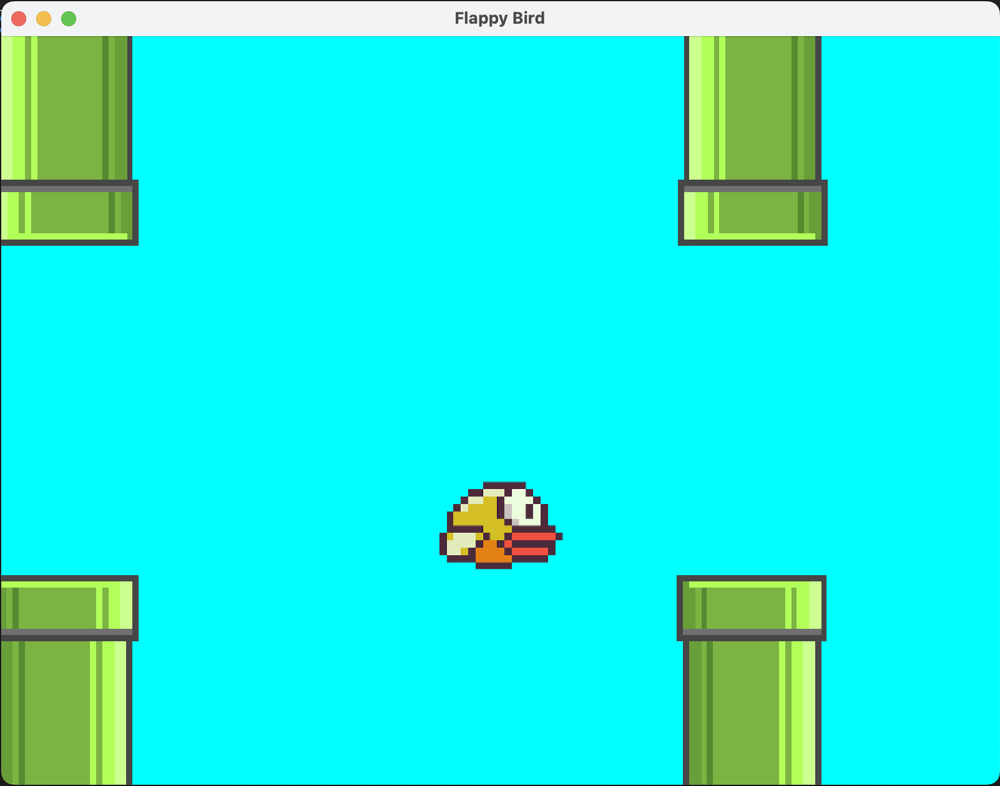

# flappy-bird-renderer

This project was to learn how to use SFML, collision detection between sprites, and the render loop.

You can use the `run.sh` script to run the game. You will need cmake and sfml installed.

## Learning Material

Render loop: https://gafferongames.com/post/fix_your_timestep/
